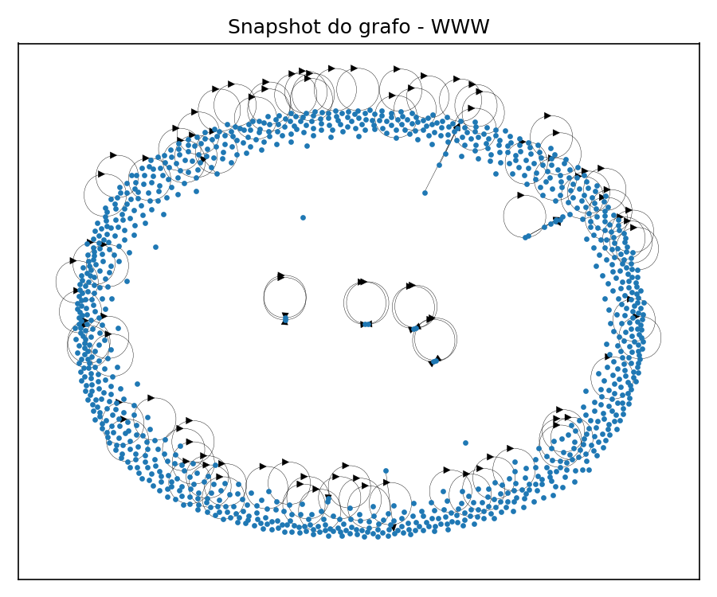
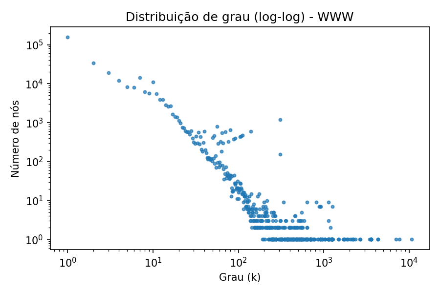
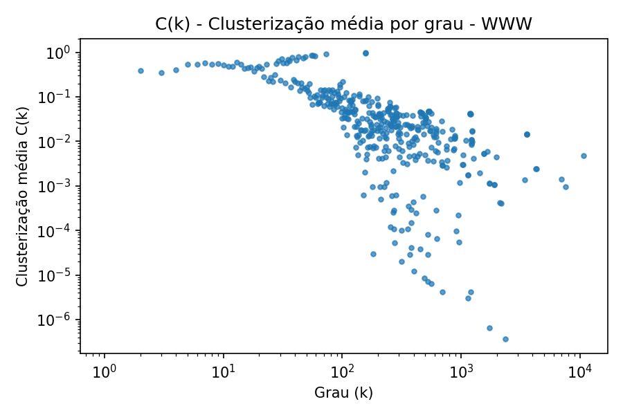
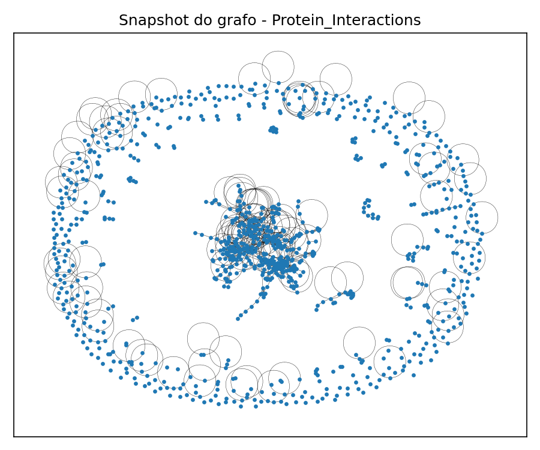
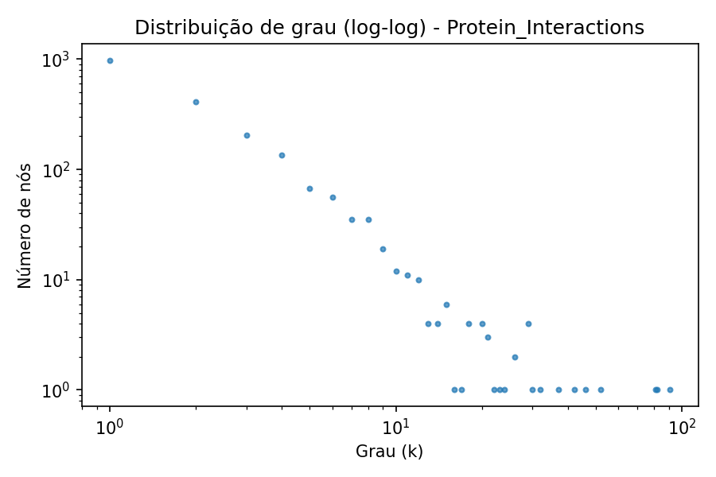
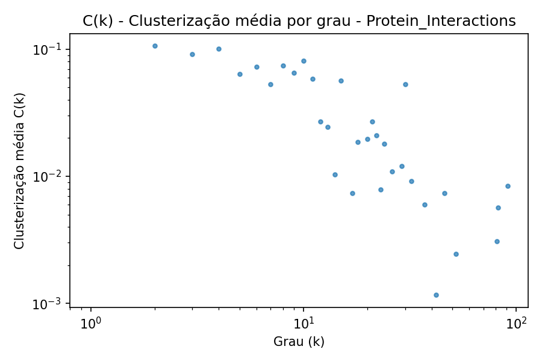
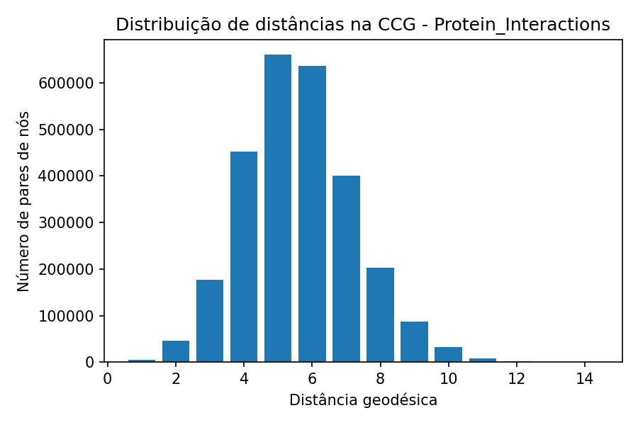

## Relatório de Métricas de Redes

Este relatório resume métricas básicas calculadas para cada rede, com breves explicações.

### Métricas e definições

- **name**: nome do dataset.

- **directed**: se a rede é direcionada (True) ou não direcionada (False).

- **n**: número de nós (|V|).

- **l**: número de arestas (|E|).

- **density**: densidade do grafo (fração de pares conectados).

- **k** / **k_in** / **k_out**: grau médio. Em não direcionados: k = 2m/n. Em direcionados: k_in = k_out = m/n.

- **S_largest_component**: fração de nós na maior componente (em dirigidos, componente fracamente conexa).

- **C_avg_clustering**: coeficiente de agrupamento médio (para dirigidos, do grafo não-direcionado equivalente).

- **r_assortatividade**: assortatividade por grau.

- **ell_all_components**: distância média agregada em TODAS as componentes (exata por componente pequena; amostrada nas grandes).

- **ell_gcc_exact**: distância média exata na CCG (se n_gcc ≤ limite).

- **diameter_gcc**: diâmetro exato da CCG (se n_gcc ≤ limite).

### Observações

- Em redes não direcionadas, **k_in** e **k_out** não se aplicam. Por isso, ao combinar resultados com redes dirigidas, essas colunas podem aparecer como NaN — isso é esperado.

- **C = 0** indica ausência de triângulos (vizinhos não se conectam entre si), não necessariamente que um nó não tenha vizinhos.

### Resultados

| name                 | directed   |      n |       m |     density |      k_in |     k_out |   S_largest_component |   C_avg_clustering |   r_assortativity |   ell_all_components |         k |   max_in_node |   max_in_deg |   max_out_node |   max_out_deg |   max_node |   max_deg |   num_components |   gcc_size |   ell_gcc_exact |   diameter_gcc |
|:---------------------|:-----------|-------:|--------:|------------:|----------:|----------:|----------------------:|-------------------:|------------------:|---------------------:|----------:|--------------:|-------------:|---------------:|--------------:|-----------:|----------:|-----------------:|-----------:|----------------:|---------------:|
| WWW                  | True       | 325729 | 1497134 | 2.10664e-05 |   4.59626 |   4.59626 |              1        |           0.234624 |        -0.0526126 |              7.05828 | nan       |         12129 |        10721 |           7137 |          3445 |        nan |       nan |                1 |     325729 |       nan       |            nan |
| Protein_Interactions | False      |   2018 |    2930 | 0.0014397   | nan       | nan       |              0.816155 |           0.046194 |        -0.0550781 |              5.61093 |   2.90387 |           nan |          nan |            nan |           nan |       1356 |        91 |              185 |       1647 |         5.61175 |             14 |

### Figuras

### Conclusões

- **WWW**:
  - Maior grau de saída: nó 7137 com 3445 arestas de saída.
  - Maior grau de entrada: nó 12129 com 10721 arestas de entrada.
  - C moderado/alto indica tendência a comunidades locais (vizinhos conectados entre si).
  - r < 0 (disassortativa): hubs tendem a conectar a nós de baixo grau.
- **Protein_Interactions**:
  - Maior grau: nó 1356 com 91 arestas.
  - C baixo sugere vizinhanças pouco conectadas (poucas tríades fechadas).
  - r < 0 (disassortativa): hubs tendem a conectar a nós de baixo grau.

